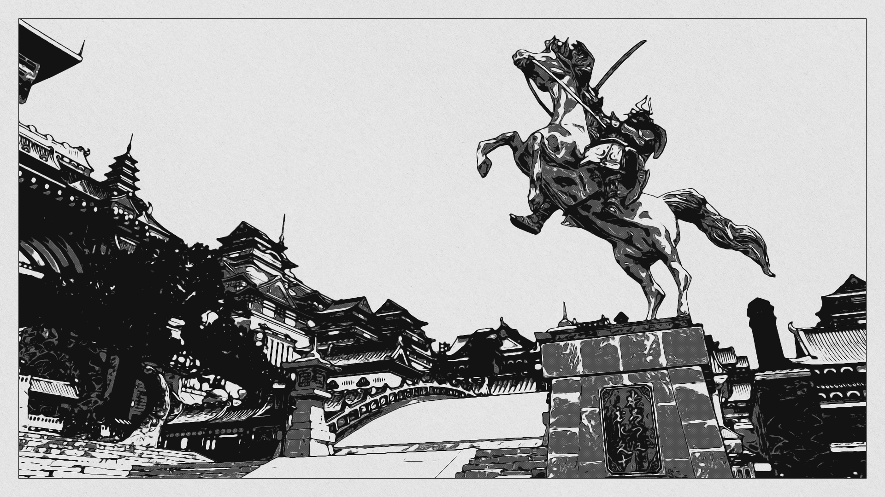

# AcerolaFX

A fully modular and completely customizable post processing pipeline intended for Final Fantasy XIV gameplay and gposing.

For information on installation and usage please refer to the [wiki](https://github.com/GarrettGunnell/AcerolaFX/wiki).

## Examples

  
  

### Credits

Big thank you to [Aki Saeri](https://twitter.com/AkiSaeri), the ultimate Final Fantasy XIV gamer, for beta testing the shaders.

References:  
https://github.com/GPUOpen-Effects/FidelityFX-CAS  
https://github.com/LordOfLunacy/Insane-Shaders/blob/master/Shaders/DevShaders/ComputeShaders/HistogramCompute.fx  
https://bruop.github.io/exposure/  
https://www.alextardif.com/HistogramLuminance.html  
https://github.com/GameTechDev/XeGTAO  
https://github.com/niessner/VoxelHashing/blob/master/DepthSensing/Shaders/BilateralFilter.hlsl